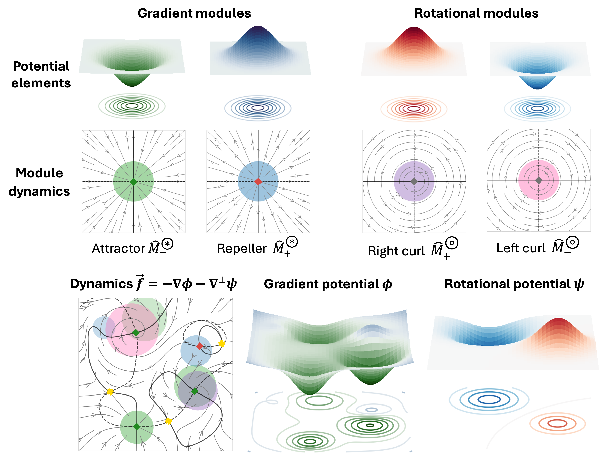

A simulation framework for constructing and optimizing epigenetic landscape models 

## 📍 Features
* Parametrized, interpretable landscapes built with Waddington-like valleys
* Modular construction using local flow elements in 2D
* Flexible topography and topology with minimal constraints
* Optimization algorithm inspired by biological evolution 

## 🌀 Landscape construction

  

## 📁 Structure 

<pre>

evoscape/
├── modules/
│   └── module_class.py                 # Module definitions
├── landscapes/
│   ├── landscape_class.py              # Core landscape definition
│   ├── landscape_dataset_fitness.py    # Landscape for fitting a timelapse dataset
│   └── landscape_segmentation.py       # Landscape for modelling tissue segmentation
├── population_class.py                 # Evolution in a population of landscapes
├── morphogen_regimes.py                # Temporal dependencies of parameters
├── helper_functions.py
├── module_helper_functions.py
└── landscape_visuals.py

- <b>examples</b>/: Example usage of Evoscape, quick optimization runs 
- scripts/: Codes for parallelized optimization, multiple runs
- notebooks/: Jupyter notebooks used for analysis and figures
</pre>

## 🚧 In development 
* Tutorials
* Interactive simulation

### References 
Scientific colormaps: Crameri, F. (2018), Scientific colour maps, doi:10.5281/
zenodo.1243862